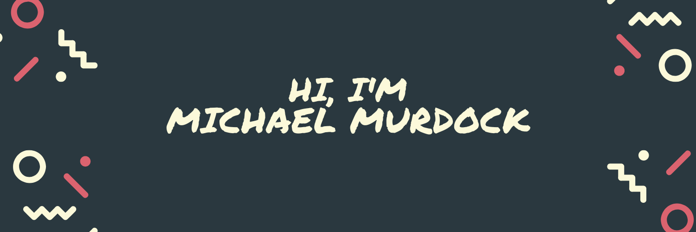

<!-- Header Image -->
<!--  -->

<!-- Badges -->

  
  
  
<!--   -->
<!--    -->
  

<!-- holic-x 

	

-->

<picture>
  <source media="(prefers-color-scheme: dark)" srcset="https://raw.githubusercontent.com/holic-x/holic-x/output/github-contribution-grid-snake-dark.svg">
  <source media="(prefers-color-scheme: light)" srcset="https://raw.githubusercontent.com/holic-x/holic-x/output/github-contribution-grid-snake.svg">
  
</picture>

<!-- Stats -->
<!--  -->
  
<!---->

<!---->
 
  
<!--  -->
